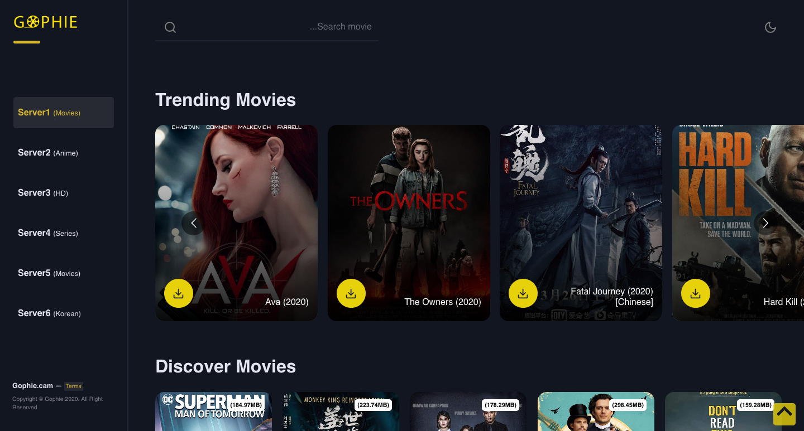

<!-- ALL-CONTRIBUTORS-BADGE:START - Do not remove or modify this section -->

<!-- ALL-CONTRIBUTORS-BADGE:END -->
  

# Gophie-web

This project is the web interface setup for [Gophie](https://github.com/go-phie/gophie) built on [React](https://github.com/facebook/react)

## Deployment

Deployment happens in two stages, master branch is automatically linked to deploy to the staging environment available on [Netlify](https://gophie.netlify.app) which enables
testing of newly integrated features. If testing goes according to plan and a tag is made, it is then released to the production environment on [GitHub Pages](https://go-phie.github.io/)

## Contributors ✨

Thanks goes to these wonderful people ([emoji key](https://allcontributors.org/docs/en/emoji-key)):

<!-- ALL-CONTRIBUTORS-LIST:START - Do not remove or modify this section -->
<!-- prettier-ignore-start -->
<!-- markdownlint-disable -->
<table>
  <tr>
    <td align="center"><a href="https://github.com/kodjunkie"> <b>Lawrence Onah</b></a> <a href="https://github.com/Go-phie/gophie-web/commits?author=kodjunkie" title="Code">💻</a> <a href="https://github.com/Go-phie/gophie-web/commits?author=kodjunkie" title="Tests">⚠️</a></td>
    <td align="center"><a href="http://nenosoft-tech.rf.gd"> <b>Nengak Dakup</b></a> <a href="https://github.com/Go-phie/gophie-web/commits?author=NengakDakup" title="Code">💻</a> <a href="#maintenance-NengakDakup" title="Maintenance">🚧</a> <a href="https://github.com/Go-phie/gophie-web/pulls?q=is%3Apr+reviewed-by%3ANengakDakup" title="Reviewed Pull Requests">👀</a></td>
    <td align="center"><a href="https://tacafrica.org"> <b>sylvernus akubo</b></a> <a href="https://github.com/Go-phie/gophie-web/issues?q=author%3Asilvareal" title="Bug reports">🐛</a> <a href="https://github.com/Go-phie/gophie-web/commits?author=silvareal" title="Code">💻</a></td>
    <td align="center"><a href="https://github.com/SLKhadeeja"> <b>SLKhadeeja</b></a> <a href="https://github.com/Go-phie/gophie-web/commits?author=SLKhadeeja" title="Code">💻</a></td>
    <td align="center"><a href="https://github.com/Amenacliff"> <b>Amena Cliff</b></a> <a href="https://github.com/Go-phie/gophie-web/commits?author=Amenacliff" title="Code">💻</a></td>
  </tr>
</table>

<!-- markdownlint-enable -->
<!-- prettier-ignore-end -->
<!-- ALL-CONTRIBUTORS-LIST:END -->

This project follows the [all-contributors](https://github.com/all-contributors/all-contributors) specification. Contributions of any kind welcome!

<!-- Contribution Guidelines -->
# Contributing
If you've ever wanted to contribute to open source, now is your chance!, Contributions are always welcome! Please read the [Contribution guidelines for this project](docs/CONTRIBUTING.md).
