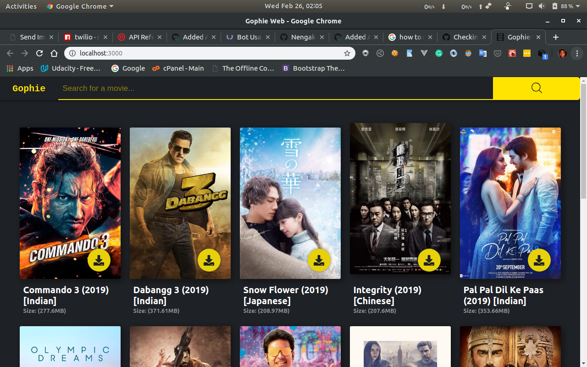

# Gophie-web

This project is the web interface setup for [Gophie](https://github.com/bisoncorps/gophie)

## Deployed Version

The deployed version is available [here](https://deven96.github.io/gophie-web)

## Todo

- [ ] Implement the search function
- [ ] Write Makefile to generate production build before pushing
